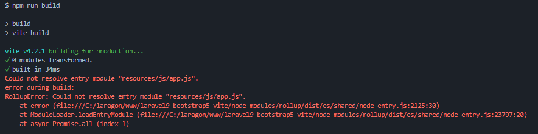

<p align="center"></p>

## Instal Statamic

```
statamic new $project_name

```
If this is your first time, we usually recommend starting with a blank site.


## Install Laravel UI Bootstrap 5

```
composer require laravel/ui
```
```
php artisan ui bootstrap
```

## Hapus Laravel-mix
``` npm remove laravel-mix && rm webpack.mix.js ```

## Install NPM
```
npm install
```
```
npm run build
```
```
npm install --save-dev vite laravel-vite-plugin
```


> **Note:** jika terdapat error seperti gambar dibawah ini: 
 
> simpan coding berikut pada file `resources/js/app.js`
 ```
  require('./bootstrap'); 
```

## Package.json
```
"scripts": {
    "dev": "vite",
    "build": "vite build"
},
```


## vite.config.js
```
import { defineConfig } from 'vite';
import laravel from 'laravel-vite-plugin';

export default defineConfig({
    plugins: [
        laravel({
            input: [
                'resources/sass/app.scss',
                'resources/js/app.js',
            ],
            refresh: true,
        }),
    ],
});

```

## Masukan ke dalam tampilan view
```
{{ vite src="resources/js/app.js|resources/sass/app.scss" }}
```

## Uninstall Tailwind CSS if no needs
```
npm uninstall tailwindcss

```
also (uninstall tailwind dev dependencies, if no other package needs them)
```
npm uninstall autoprefixer
npm uninstall postcss
```